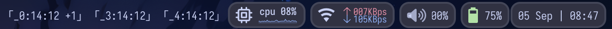

<figure>
  
  

    <figcaption>
       A quick demo of <tt>calnext</tt> and <tt>calmod</tt> which compose
      <tt>cal-suite</tt>.
    </figcaption>
    

</figure>

`cal-suite` is an informal name for command-line wrappers for
[gcalcli](https://github.com/insanum/gcalcli), an unofficial command-line
interface to Google Calendar. These wrappers have been updated frequently and
haphazardly as my needs have changed.

---

In my early days of college, I would frequently neglect to complete assignments
or procrastinate severely since I never had an excellent perception on how
"close" a deadline would be. Google Calendar was a common solution that many of
my peers used, but I never liked the idea of pulling out my phone or a web
browser to check my deadlines.

As most of my computer interaction is done through terminal-based applications,
I decided to write something that would essentially show how many days and hours
I have left until my next deadline. `gcalcli` itself was an excellent
improvement, but `cal-suite` became a necessity due to my desire to exert
greater control over the number of deadlines to be displayed, shortcuts to input
event names associated with specific courses I'd be taking in a given semester,
and so forth. As a result, my closest deadlines are always visible in front of
me whenever I'm on my computer, which has helped me stay accountable.

<figure>
  
  

    <figcaption>
      My status bar for my Macbook Air. Thanks to the <tt>calnext</tt> output to
      the left, I can immediately tell that I have 2 deadlines due in 14 hours
      and 14 minutes.
    </figcaption>
    

</figure>

---

Though the code was written by me, this project would have not been possible
without `gcalcli` and inspiration from its example integration with
[tmux](https://github.com/tmux/tmux), from which I began to write `cal-suite`.

This project was one of the reasons why I grew to love coding (to the point that
I'd select both of my interdisciplinary electives to be classes that teach about
programming --- which includes ICS 314). I'd fall into cycles of editing code to
add functionality, then hastily rewrite it to see what else I could do with it.
I learned a bit about some of Python's standard libraries (`os`, `subprocess`,
`argparse`, `pickle`, and `time`), touched on class-based and non-class-based
approaches to the problem, and a few other things that kept me from getting too
rusty with programming.

I do not have a repository that logs the development of the script, but you can
find the source for `calnext` (prints upcoming deadlines) [here](./calnext) and
`calmod` (quickly add, edit, or delete events) [here](./calmod) at the time of
writing.
