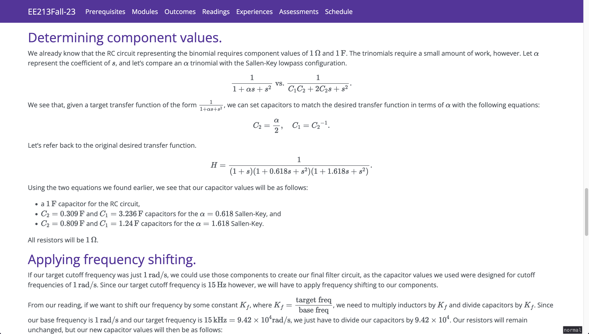

<figure>
  

    
    

</figure>

During my EE 213 (Basic Circuit Analysis II), my instructor expressed his desire
to put up class materials on an easily-accessible website with which current,
former, and prospective students could study, review, or preview the material,
respectively. Students were given the opportunity to work on the site using the
[Morea framework](https://morea-framework.github.io/), and I was one of the 2
members responsible for setting up the site and pushing student-made content on
it.

That project solidified my interest and pleasure in working with code and
computer-based science and engineering, which has made most of my technical
electives ICS-adjacent and class deliverables code-based where possible.

---

As the project was content-first, most of the defaults have been left in place
(including that of the instructor's name, which some of you may be familiar
with). Should you still wish to peruse that scrappy little project we put
together in a short amount of time, you can find the live site
[here](https://uhmchris.github.io/EE213/index.html) and the source code
[here](https://github.com/uhmchris/EE213).
